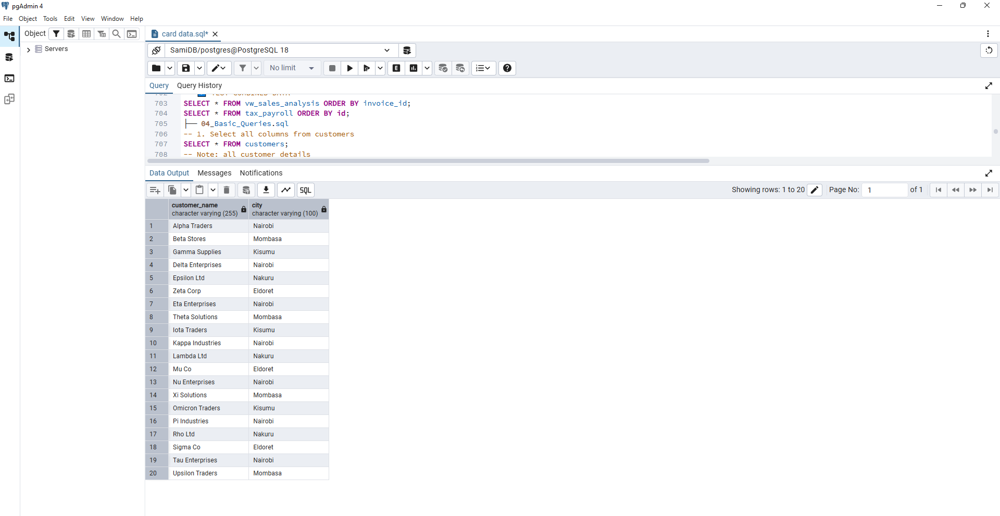

SQL-Practice-Project/
│
├── 01_Create_Tables.sql
CREATE TABLE customers (
    customer_id SERIAL PRIMARY KEY,
    customer_name VARCHAR(255),
    city VARCHAR(100)
);

CREATE TABLE sales_reps (
    rep_id SERIAL PRIMARY KEY,
    rep_name VARCHAR(255)
);

CREATE TABLE invoices (
    invoice_id SERIAL PRIMARY KEY,
    customer_id INT,
    rep_id INT,
    invoice_date DATE,
    invoice_amount NUMERIC(12,2)
);

CREATE TABLE payments (
    payment_id SERIAL PRIMARY KEY,
    invoice_id INT,
    payment_date DATE,
    amount_paid NUMERIC(12,2)
);

CREATE TABLE tax_payroll(
    id SERIAL PRIMARY KEY,
    full_name VARCHAR(255),
    dept VARCHAR(255),
    gross_pay NUMERIC(12,2),
    taxable_pay NUMERIC(12,2),
    shif NUMERIC(12,2),
    nssf NUMERIC(12,2),
    ahl NUMERIC(12,2),
    paye NUMERIC(12,2),
    net_pay NUMERIC(12,2)
);
├── 02_Insert_Data.sql
-- 3️⃣ INSERT CUSTOMERS (20 entries)
INSERT INTO customers(customer_name, city) VALUES
('Alpha Traders','Nairobi'), ('Beta Stores','Mombasa'), ('Gamma Supplies','Kisumu'),
('Delta Enterprises','Nairobi'), ('Epsilon Ltd','Nakuru'), ('Zeta Corp','Eldoret'),
('Eta Enterprises','Nairobi'), ('Theta Solutions','Mombasa'), ('Iota Traders','Kisumu'),
('Kappa Industries','Nairobi'), ('Lambda Ltd','Nakuru'), ('Mu Co','Eldoret'),
('Nu Enterprises','Nairobi'), ('Xi Solutions','Mombasa'), ('Omicron Traders','Kisumu'),
('Pi Industries','Nairobi'), ('Rho Ltd','Nakuru'), ('Sigma Co','Eldoret'),
('Tau Enterprises','Nairobi'), ('Upsilon Traders','Mombasa');

-- 4️⃣ INSERT SALES REPS (5 entries)
INSERT INTO sales_reps(rep_name) VALUES
('James Kariuki'), ('Mary Wanjiru'), ('Brian Otieno'), ('Alice Mwikali'), ('Kevin Odhiambo');

-- 5️⃣ INSERT INVOICES (20 entries)
INSERT INTO invoices(customer_id, rep_id, invoice_date, invoice_amount) VALUES
(1,1,'2025-01-10',120000), (2,1,'2025-01-15',85000), (3,2,'2025-01-20',45000),
(4,3,'2025-01-25',200000), (5,2,'2025-02-01',75000), (6,4,'2025-02-05',95000),
(7,5,'2025-02-10',60000), (8,1,'2025-02-15',80000), (9,2,'2025-02-20',55000),
(10,3,'2025-02-25',100000), (11,4,'2025-03-01',120000), (12,5,'2025-03-05',90000),
(13,1,'2025-03-10',70000), (14,2,'2025-03-15',65000), (15,3,'2025-03-20',85000),
(16,4,'2025-03-25',95000), (17,5,'2025-04-01',105000), (18,1,'2025-04-05',115000),
(19,2,'2025-04-10',125000), (20,3,'2025-04-15',135000);

-- 6️⃣ INSERT PAYMENTS (20 entries, some partial)
INSERT INTO payments(invoice_id, payment_date, amount_paid) VALUES
(1,'2025-01-20',50000), (1,'2025-02-10',70000), (2,'2025-01-30',85000),
(3,'2025-02-01',45000), (4,'2025-02-05',100000), (5,'2025-02-15',50000),
(6,'2025-02-20',95000), (7,'2025-02-25',60000), (8,'2025-03-01',40000),
(9,'2025-03-05',55000), (10,'2025-03-10',50000), (11,'2025-03-15',120000),
(12,'2025-03-20',90000), (13,'2025-03-25',35000), (14,'2025-04-01',65000),
(15,'2025-04-05',85000), (16,'2025-04-10',95000), (17,'2025-04-15',105000),
(18,'2025-04-20',115000), (19,'2025-04-25',125000), (20,'2025-04-30',135000);

-- 7️⃣ INSERT PAYROLL (30 employees) with calculated SHIF, AHL, NSSF, TAXABLE_PAY, PAYE, NET_PAY
WITH employees AS (
    SELECT * FROM (VALUES
        ('Mike Maina', 'Finance', 50000), ('Steve Mbogo', 'Sales', 24000),
        ('Cliff Obeta', 'Finance', 72000), ('Nancy Akinyi', 'IT', 500000),
        ('Linda Momanyi', 'Sales', 50000), ('Peter Njoroge', 'Finance', 65000),
        ('Sarah Wanjiku', 'IT', 90000), ('James Mwangi', 'Sales', 30000),
        ('Alice Cheruiyot', 'HR', 45000), ('Brian Odhiambo', 'Finance', 80000),
        ('Catherine Kimani', 'IT', 120000), ('Daniel Ouma', 'Sales', 40000),
        ('Esther Mwikali', 'HR', 35000), ('Frank Otieno', 'Finance', 95000),
        ('Grace Achieng', 'IT', 60000), ('Henry Karanja', 'Sales', 28000),
        ('Irene Nduta', 'HR', 50000), ('John Kamau', 'Finance', 110000),
        ('Joyce Wairimu', 'IT', 70000), ('Kevin Oduor', 'Sales', 38000),
        ('Linda Njeri', 'HR', 32000), ('Martin Mutua', 'Finance', 125000),
        ('Nancy Chebet', 'IT', 80000), ('Oliver Kibet', 'Sales', 45000),
        ('Patricia Wanjiru', 'HR', 40000), ('Quentin Otieno', 'Finance', 55000),
        ('Ruth Njeri', 'IT', 95000), ('Samuel Kiptoo', 'Sales', 60000),
        ('Theresa Akinyi', 'HR', 37000), ('Victor Ochieng', 'Finance', 100000)
    ) AS t(full_name, dept, gross_pay)
)
INSERT INTO tax_payroll(full_name, dept, gross_pay, shif, ahl, nssf, taxable_pay, paye, net_pay)
SELECT 
    full_name,
    dept,
    gross_pay,
    ROUND(gross_pay*0.0275,2) AS shif,
    ROUND(gross_pay*0.015,2) AS ahl,
    ROUND(LEAST(gross_pay*0.06,4320),2) AS nssf,
    ROUND(gross_pay - (gross_pay*0.0275) - (gross_pay*0.015) - LEAST(gross_pay*0.06,4320),2) AS taxable_pay,
    CASE 
        WHEN gross_pay - (gross_pay*0.0275) - (gross_pay*0.015) - LEAST(gross_pay*0.06,4320) <= 24000 THEN ROUND(GREATEST((gross_pay - (gross_pay*0.0275) - (gross_pay*0.015) - LEAST(gross_pay*0.06,4320))*0.10-2400,0),2)
        WHEN gross_pay - (gross_pay*0.0275) - (gross_pay*0.015) - LEAST(gross_pay*0.06,4320) <= 32333 THEN ROUND(GREATEST(24000*0.10+((gross_pay - (gross_pay*0.0275) - (gross_pay*0.015) - LEAST(gross_pay*0.06,4320))-24000)*0.25-2400,0),2)
        WHEN gross_pay - (gross_pay*0.0275) - (gross_pay*0.015) - LEAST(gross_pay*0.06,4320) <= 500000 THEN ROUND(GREATEST(24000*0.10+(32333-24000)*0.25+((gross_pay - (gross_pay*0.0275) - (gross_pay*0.015) - LEAST(gross_pay*0.06,4320))-32333)*0.30-2400,0),2)
        WHEN gross_pay - (gross_pay*0.0275) - (gross_pay*0.015) - LEAST(gross_pay*0.06,4320) <= 800000 THEN ROUND(GREATEST(24000*0.10+(32333-24000)*0.25+(500000-32333)*0.30+((gross_pay - (gross_pay*0.0275) - (gross_pay*0.015) - LEAST(gross_pay*0.06,4320))-500000)*0.325-2400,0),2)
        ELSE ROUND(GREATEST(24000*0.10+(32333-24000)*0.25+(500000-32333)*0.30+(800000-500000)*0.325+((gross_pay - (gross_pay*0.0275) - (gross_pay*0.015) - LEAST(gross_pay*0.06,4320))-800000)*0.35-2400,0),2)
    END AS paye,
    gross_pay - ROUND(gross_pay*0.0275,2) - ROUND(gross_pay*0.015,2) - ROUND(LEAST(gross_pay*0.06,4320),2) - 
    CASE 
        WHEN gross_pay - (gross_pay*0.0275) - (gross_pay*0.015) - LEAST(gross_pay*0.06,4320) <= 24000 THEN ROUND(GREATEST((gross_pay - (gross_pay*0.0275) - (gross_pay*0.015) - LEAST(gross_pay*0.06,4320))*0.10-2400,0),2)
        WHEN gross_pay - (gross_pay*0.0275) - (gross_pay*0.015) - LEAST(gross_pay*0.06,4320) <= 32333 THEN ROUND(GREATEST(24000*0.10+((gross_pay - (gross_pay*0.0275) - (gross_pay*0.015) - LEAST(gross_pay*0.06,4320))-24000)*0.25-2400,0),2)
        WHEN gross_pay - (gross_pay*0.0275) - (gross_pay*0.015) - LEAST(gross_pay*0.06,4320) <= 500000 THEN ROUND(GREATEST(24000*0.10+(32333-24000)*0.25+((gross_pay - (gross_pay*0.0275) - (gross_pay*0.015) - LEAST(gross_pay*0.06,4320))-32333)*0.30-2400,0),2)
        WHEN gross_pay - (gross_pay*0.0275) - (gross_pay*0.015) - LEAST(gross_pay*0.06,4320) <= 800000 THEN ROUND(GREATEST(24000*0.10+(32333-24000)*0.25+(500000-32333)*0.30+((gross_pay - (gross_pay*0.0275) - (gross_pay*0.015) - LEAST(gross_pay*0.06,4320))-500000)*0.325-2400,0),2)
        ELSE ROUND(GREATEST(24000*0.10+(32333-24000)*0.25+(500000-32333)*0.30+(800000-500000)*0.325+((gross_pay - (gross_pay*0.0275) - (gross_pay*0.015) - LEAST(gross_pay*0.06,4320))-800000)*0.35-2400,0),2)
    END AS net_pay
FROM employees;

├── 03_Views.sql
CREATE VIEW vw_sales_analysis AS
SELECT
    i.invoice_id,
    c.customer_name,
    c.city,
    s.rep_name,
    i.invoice_date,
    i.invoice_amount,
    COALESCE(SUM(p.amount_paid),0) AS total_paid,
    i.invoice_amount - COALESCE(SUM(p.amount_paid),0) AS balance
FROM invoices i
JOIN customers c ON i.customer_id = c.customer_id
JOIN sales_reps s ON i.rep_id = s.rep_id
LEFT JOIN payments p ON i.invoice_id = p.invoice_id
GROUP BY i.invoice_id, c.customer_name, c.city, s.rep_name, i.invoice_date, i.invoice_amount;

-- 9️⃣ TEST COMBINED DATA
SELECT * FROM vw_sales_analysis ORDER BY invoice_id;
SELECT * FROM tax_payroll ORDER BY id;
├── 04_Basic_Queries.sql
-- 1. Select all columns from customers
SELECT * FROM customers;
-- Note: all customer details
## Query 1 Output

-- 2. Select only customer_name and city from customers
SELECT customer_name, city FROM customers;
-- Note: customer names and cities

-- 3. Select all sales reps’ names from sales_reps
SELECT rep_name FROM sales_reps;
-- Note: list of all sales reps

-- 4. Select invoices where invoice_amount > 100000
SELECT invoice_id, invoice_amount FROM invoices WHERE invoice_amount > 100000;
-- Note: invoices greater than 100,000

-- 5. Select payments greater than 50000
SELECT payment_id, amount_paid FROM payments WHERE amount_paid > 50000;
-- Note: payments exceeding 50,000

-- 6. Select employees in the Finance department
SELECT full_name, dept FROM tax_payroll WHERE dept = 'Finance';
-- Note: employees in Finance

-- 7. Select all invoices ordered by invoice_date ascending
SELECT invoice_id, invoice_date, invoice_amount FROM invoices ORDER BY invoice_date ASC;
-- Note: invoices sorted by date ascending

-- 8. Select all payroll employees ordered by gross_pay descending
SELECT full_name, gross_pay FROM tax_payroll ORDER BY gross_pay DESC;
-- Note: employees sorted by highest gross pay

-- 9. Select customers from Nairobi
SELECT customer_id, customer_name FROM customers WHERE city = 'Nairobi';
-- Note: customers in Nairobi

-- 10. Select sales reps whose name starts with 'J'
SELECT rep_name FROM sales_reps WHERE rep_name LIKE 'J%';
-- Note: sales reps with names starting with 'J'

-- 11. Select invoices between '2025-02-01' and '2025-03-01'
SELECT * FROM invoices WHERE invoice_date BETWEEN '2025-02-01' AND '2025-03-01';
-- Note: invoices in this date range

-- 12. Select employees with gross_pay between 50000 and 100000
SELECT * FROM tax_payroll WHERE gross_pay BETWEEN 50000 AND 100000;
-- Note: employees earning 50k–100k

-- 13. Select customers whose name contains 'Enterprises'
SELECT * FROM customers WHERE customer_name ILIKE '%enterprises%';
-- Note: customers with 'Enterprises' in name

-- 14. Select sales reps whose name is either 'James Kariuki' or 'Brian Otieno'
SELECT * FROM sales_reps WHERE rep_name IN ('James Kariuki', 'Brian Otieno');
-- Note: James Kariuki or Brian Otieno

-- 15. Select payments not equal to 100000
SELECT * FROM payments WHERE amount_paid != 100000;
-- Note: payments not equal to 100,000

-- 16. Select payroll employees not in HR department
SELECT * FROM tax_payroll WHERE dept IN ('Finance','Sales','IT');
-- Note: employees not in HR

-- 17. Select invoices where invoice_amount >= 90000 AND rep_id = 1
SELECT * FROM invoices WHERE invoice_amount >= 90000 AND rep_id = 1;
-- Note: invoices ≥90k handled by rep 1

-- 18. Select employees whose name ends with 'Mwangi'
SELECT * FROM tax_payroll WHERE full_name LIKE '%Mwangi';
-- Note: employees with last name 'Mwangi'

-- 19. Select customers not from Mombasa
SELECT * FROM customers WHERE city <> 'Mombasa';
-- Note: customers outside Mombasa

-- 20. Select invoices where invoice_amount is a multiple of 5000
SELECT * FROM invoices WHERE invoice_amount % 5000 = 0;
-- Note: invoices divisible by 5000

-- 21. Count the total number of customers
SELECT COUNT(*) AS total_customers FROM customers;
-- Note: total number of customers

-- 22. Count invoices per customer
SELECT c.customer_name, COUNT(i.invoice_id) AS invoice_per_customer
FROM customers c
LEFT JOIN invoices i ON c.customer_id = i.customer_id
GROUP BY c.customer_name
ORDER BY invoice_per_customer;
-- Note: number of invoices per customer

-- 23. Sum of all invoice amounts
SELECT SUM(invoice_amount) AS total_invoices FROM invoices;
-- Note: total sum of invoices

-- 24. Average invoice_amount per customer
SELECT c.customer_name, AVG(i.invoice_amount) AS avg_invoice
FROM customers c
JOIN invoices i ON c.customer_id = i.customer_id
GROUP BY c.customer_name;
-- Note: average invoice amount per customer

-- 25. Maximum gross pay in payroll
SELECT MAX(gross_pay) AS max_gross FROM tax_payroll;
-- Note: highest gross pay

-- 26. Minimum gross pay in payroll
SELECT MIN(gross_pay) AS min_gross FROM tax_payroll;
-- Note: lowest gross pay

-- 27. Total payments received
SELECT SUM(amount_paid) AS total_paid FROM payments;
-- Note: total payments received

-- 28. Total unpaid invoice balance
SELECT SUM(i.invoice_amount - COALESCE(paid.total_paid, 0)) AS total_balance
FROM invoices i
LEFT JOIN (
    SELECT invoice_id, SUM(amount_paid) AS total_paid
    FROM payments
    GROUP BY invoice_id
) AS paid ON i.invoice_id = paid.invoice_id;
-- Note: total unpaid invoice balance

-- 29. Average net_pay in payroll
SELECT AVG(net_pay) AS avg_net_pay FROM tax_payroll;
-- Note: average net pay

-- 30. Count of payroll employees per department
SELECT dept, COUNT(*) AS employee_count
FROM tax_payroll
GROUP BY dept;
-- Note: employee count per department
├── 05_GroupBy_Having.sql
--31.	Total invoice amount per customer.
SELECT
c.customer_name,
SUM(i.invoice_amount) AS amount_per_customer
FROM customers c
LEFT JOIN invoices i ON c.customer_id = i.customer_id
GROUP BY c.customer_name
ORDER BY amount_per_customer DESC;
--32.	Total invoice amount per sales rep.
SELECT 
s.rep_name,
SUM(i.invoice_amount)AS total_amount
FROM sales_reps s
LEFT JOIN invoices i ON s.rep_id = i.rep_id
GROUP BY s.rep_name
ORDER By total_amount DESC;

--33.	Total payments received per customer.
SELECT
c.customer_name,
i.customer_id,
SUM(p.amount_paid)AS total_paid_per_customer
FROM customers c
LEFT JOIN invoices i ON c.customer_id = i.customer_id
LEFT JOIN payments p ON i.invoice_id = p.invoice_id
GROUP BY c.customer_name,i.customer_id
ORDER BY total_paid_per_customer DESC;

--34.	Count of invoices per sales rep.
SELECT
s.rep_name,
COUNT(i.invoice_id) AS invoices_per_sale_rep
FROM sales_reps s
LEFT JOIN invoices i ON s.rep_id = i.rep_id
GROUP BY s.rep_name;

--35.	Average invoice amount per customer.
SELECT
c.customer_name,
ROUND(AVG(i.invoice_amount),2) AS avg_invoice_amount
FROM customers c
LEFT JOIN invoices i ON c.customer_id = i.customer_id
GROUP BY c.customer_name
ORDER BY avg_invoice_amount DESC;
--36.	Customers with total invoice amount > 200000.
SELECT
c.customer_name,
ROUND(SUM(i.invoice_amount),2) AS sum_invoice_amount
FROM customers c
LEFT JOIN invoices i ON c.customer_id = i.customer_id
GROUP BY c.customer_name
HAVING SUM(i.invoice_amount)>20000
ORDER BY sum_invoice_amount DESC ;
--37.	Departments with average gross_pay > 80000.
SELECT
dept,
ROUND(AVG(gross_pay),2) AS avg_gross_pay
FROM tax_payroll
GROUP BY dept
HAVING AVG(gross_pay)>80000
ORDER BY avg_gross_pay DESC;

--38.	Count of employees with net_pay > 50000 per department.
SELECT
dept,
COUNT(CASE WHEN net_pay >50000 THEN 1 END)AS number_of_employees
FROM tax_payroll
GROUP BY dept
ORDER BY number_of_employees DESC;

--39.	Total payments per invoice.
SELECT
i.invoice_id,
SUM(p.amount_paid)AS total_paid
FROM invoices i
LEFT JOIN payments p ON i.invoice_id = p.invoice_id
GROUP BY i.invoice_id
ORDER BY total_paid DESC;

--40.	Sales reps with more than 3 invoices.
SELECT
s.rep_name,
COUNT(i.invoice_id) AS total_invoices
FROM sales_reps s
LEFT JOIN invoices i ON s.rep_id =i.rep_id
GROUP BY s.rep_name
HAVING COUNT(i.invoice_id)>3
ORDER BY total_invoices;
├── 06_Joins.sql
--41.	Join invoices and customers to get customer_name for each invoice.
SELECT
c.customer_name,
i.invoice_id
FROM customers c
JOIN invoices i ON c.customer_id=i.customer_id;

--42.	Join invoices and sales_reps to get rep_name for each invoice.
SELECT 
i.invoice_id,
s.rep_name
FROM invoices i
JOIN sales_reps s ON i.rep_id = s.rep_id;

--43.	Left join payments to invoices to see all invoices even if unpaid.

SELECT 
i.invoice_id,
p.payment_id
FROM invoices i
LEFT JOIN payments p ON i.invoice_id = p.invoice_id;
--44.	Inner join payments with invoices to see paid invoices only.
SELECT 
i.invoice_id,
p.payment_id
FROM invoices i
JOIN payments p ON i.invoice_id = p.invoice_id;

--45.	Join customers, invoices, and payments to show invoice balance.
SELECT
    c.customer_name,
    i.invoice_id,
    i.invoice_amount,
    COALESCE(SUM(p.amount_paid), 0) AS total_paid,
    i.invoice_amount - COALESCE(SUM(p.amount_paid), 0) AS balance
FROM customers c
JOIN invoices i ON c.customer_id = i.customer_id
LEFT JOIN payments p ON i.invoice_id = p.invoice_id
GROUP BY
    c.customer_name,
    i.invoice_id,
    i.invoice_amount
ORDER BY i.invoice_id;

--46.	Join tax_payroll with employees in Sales to show gross pay.
SELECT 
full_name,
dept,
gross_pay
FROM tax_payroll
WHERE dept = 'Sales'
ORDER BY gross_pay DESC;

--47.	Full join invoices and payments to see invoices without payments and extra payments.
SELECT
i.invoice_id,
i.invoice_amount,
p.payment_id,
p.amount_paid
FROM invoices i
FULL JOIN payments p ON i.invoice_id=p.invoice_id;

--48.	Join invoices with sales_reps and count invoices per rep.
SELECT
s.rep_name,
COUNT(i.invoice_id)AS invoices_per_rep
FROM sales_reps s
JOIN invoices i ON s.rep_id = i.rep_id
GROUP BY s.rep_name
ORDER BY invoices_per_rep DESC;

--49.	Join customers and payments to see total payment received per city.
SELECT
    c.city,
    SUM(p.amount_paid) AS total_payments
FROM customers c
JOIN invoices i ON c.customer_id = i.customer_id
JOIN payments p ON i.invoice_id = p.invoice_id
GROUP BY c.city
ORDER BY total_payments DESC;
--50.	Join invoices and tax_payroll to show invoices and employee payroll side-by-side (practice outer join).
SELECT
    i.invoice_id,
    i.invoice_amount,
    t.full_name AS employee_name,
    t.gross_pay
FROM invoices i
LEFT JOIN tax_payroll t
ON 1=1  -- no real join condition, just for practice to show side-by-side
ORDER BY i.invoice_id;

├── 07_Subqueries.sql
--51.	Find employees whose gross_pay is greater than the average gross_pay.
SELECT
full_name,
dept,
gross_pay
FROM tax_payroll
WHERE gross_pay >(
SELECT AVG(gross_pay)
FROM tax_payroll
);
--52.	Find invoices greater than the average invoice amount.
SELECT
invoice_id,
invoice_amount
FROM invoices
WHERE invoice_amount > (
SELECT AVG(invoice_amount)
FROM invoices);
--53.	Find customers who have invoices > 100000.
SELECT 
c.customer_name,
i.invoice_id,
i.invoice_amount
FROM customers c
JOIN invoices i ON c.customer_id = i.customer_id
WHERE invoice_amount>100000;
--54.	Find payroll employees earning more than the maximum gross_pay of HR.
SELECT 
full_name,
gross_pay
FROM tax_payroll
WHERE gross_pay > (
SELECT MAX(gross_pay)
FROM tax_payroll
WHERE dept ='HR'
);

--55.	Count invoices where amount_paid < average payment amount.
SELECT
COUNT(DISTINCT i.invoice_id)AS no_of_invoices
FROM invoices i
JOIN payments p ON i.invoice_id=p.invoice_id
WHERE p.amount_paid<(
SELECT 
AVG(p.amount_paid)
FROM payments p
);
--56.	List customers who never made a payment.
SELECT
    c.customer_name
FROM customers c
LEFT JOIN invoices i ON c.customer_id = i.customer_id
LEFT JOIN payments p ON i.invoice_id = p.invoice_id
GROUP BY c.customer_name
HAVING COALESCE(SUM(p.amount_paid), 0) = 0;

--57.	Find invoices with the highest balance.
--58.	Find sales reps who handled the most invoices.
--59.	Select payroll employees whose net_pay > average net_pay in their department.
--60.	Find payments where amount_paid = (SELECT MAX(amount_paid) FROM payments).
├── 08_Window_Functions.sql
--61.	Rank payroll employees by net_pay in each department.
--62.	Show cumulative sum of invoice_amount per customer.
--63.	Show cumulative payments per invoice.
--64.	Display running total of gross_pay for payroll ordered by id.
--65.	Show row_number of invoices per customer ordered by invoice_date.
--66.	Show dense_rank of employees by gross_pay per department.
--67.	Show lag and lead of invoice amounts to compare previous and next invoice.
--68.	Show moving average of payments per invoice.
--69.	Partition payroll by department and show average net_pay.
--70.	Show percent_rank of employees by gross_pay.
├── 09_Advanced_Filters.sql
--71.	Display a new column payment_status for invoices: 'Paid' or 'Unpaid'.
--72.	Show payroll and categorize net_pay as 'Low', 'Medium', 'High'.
--73.	Replace NULL payments with 0 using COALESCE.
--74.	Show customers with city defaulted to 'Unknown' if NULL.
--75.	Show employees with gross_pay > 100000 as 'High Earner', else 'Normal'.
--76.	Highlight invoices with balance > 50000 as 'Outstanding'.
--77.	Count customers with no invoices using LEFT JOIN and CASE.
--78.	Replace NULL rep_name in invoices with 'Not Assigned'.
--79.	Categorize invoice_amount into bands (0-50000, 50001-100000, 100001+).
--80.	Show payroll net_pay difference from department average using CASE.
├── 10_Analytics.sql
--81.	Show top 3 customers by total invoice amount.
--82.	Show top 3 employees by net_pay per department.
--83.	Calculate total payment per customer per month.
--84.	Show unpaid invoice count per sales rep.
--85.	Show average invoice balance per city.
--86.	Show cumulative net_pay for payroll per department.
--87.	Show invoice balance percentage (balance/invoice_amount * 100).
--88.	Show total payroll cost per department.
--89.	List top 5 invoices with highest payment delays (invoice_date vs payment_date).
--90.	Show average payment delay per sales rep.

--Level 10 – Complex Analytics, Joins, CTEs, and Combined Operations
--91.	Find customers with multiple invoices unpaid.
--92.	Show all invoices with total paid and remaining balance.
--93.	Rank invoices by balance within each city.
--94.	Find sales reps with highest total invoiced amount.
--95.	Show monthly invoice summary: total invoiced, total paid, balance.
--96.	Show payroll comparison: each employee vs department average net_pay.
--97.	Find invoices where total payments exceed invoice_amount (overpayment).
--98.	Show cumulative payments per customer using window functions.
--99.	Find top 3 employees with largest difference between gross_pay and net_pay.
--100.	Create a single query combining customers, invoices, payments, sales_reps and show:
		--•	Customer
		--•	City
		--•	Rep
		--•	Total invoice amount
		--•	Total paid
		--•	Balance
		--•	Number of invoices
└── README.md
